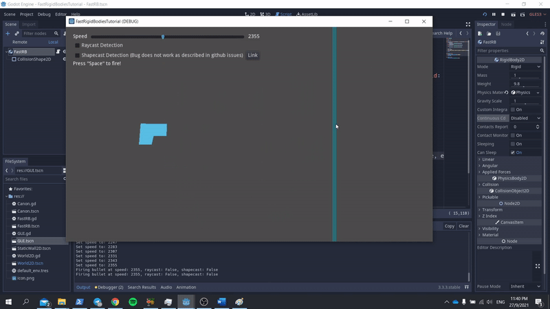

# [Godot] Handling Fast Rigid Body Collisions 

-------


As of the time of writing, I am using the latest released Godot 3.3. As observed from the above gif, it is not uncommon for game engines to face collision issues for fast moving rigid-bodies that cannot "Clip-through" and not interact with static bodies, especially thin static bodies.

## Why?

What seems to be causing the issue? Game engines, like Godot, run at constant rates or "ticks" to perform (physics) calculations and render the output on our screens. In the above example, the physics tick rate is set at a constant 60 fps ( 16.67 ms). This means at every physics frame time (~ 16.67ms), Godot simulates the position of our fast moving bullet 16.67ms in the future, and then renders it out to our screens. In the case of a "not-so-fast-moving" bullet, after one physics frame, the bullet collides and overlaps with the static body wall. This overlap would inform Godot's physics engine that a collision has occurred, and Godot would render the corresponding action (the bullet bouncing off the wall for instance).


Now, it so happens that despite the small frame time, the entirety of the bullet has crossed from the left hand side of the static body wall to the right hand side of the static body wall. 


## 2D - Solution

There are of course numerous ways to overcome this issue.

1) One can increase the physics tick rate, for example 120 fps (8.33ms). This allows Godot to better simulate fast moving rigid body objects, however it comes with a cost - increasing your CPU load which is not ideal in the case of my potato computer.

2) Making the collision shape(s) larger. Again, with larger collision shapes, Godot can better simulate fast moving rigid body objects as the likelihood of overlapping collision shapes would be higher with each physics time step, thereby increasing the maximum speed for your fast moving rigid body objects! However, this is again not feasible at times. We might want small bullets, and we may have thin walls that we want the bullets to collide with.

3) Enable CCD! What is CCD? CCD is short for continuous collision detection, which is a more performance heavy computation method to allow us to simulate better collision for fast moving rigid bodies in Godot! This is literally a "ONE BUTTON SOLVE ALL" method. (However, this is only for the case of 2D. In the case of 3D, such a functionality does not exist, so a workaround would be presented below). 

   

   The following GIF shows the CCD enabled (via the GUI). For those who are more code savvy, the following line of code can be used:

   ```python
   continuous_cd = RigidBody2D.CCD_MODE_CAST_RAY
   ```

   Otherwise, the in-editor option of setting CCD works as well (Refer to the above image).

   

   

   
